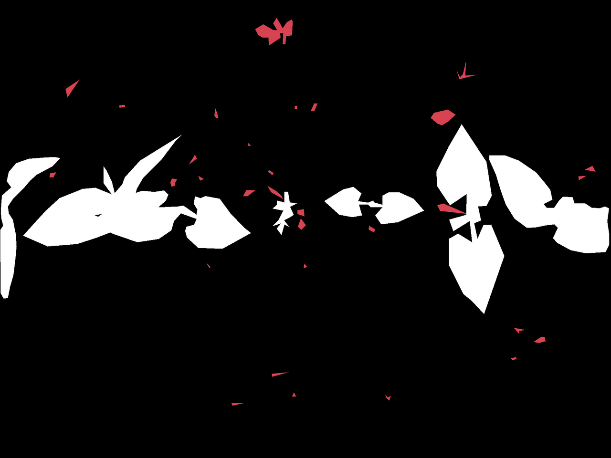

# Artificial Neural Networks and Deep Learning challenges

This repository contains the Jupyter Notebooks that we created for the competition hosted by the [*Artificial Neural Network and Deep Learning*](http://chrome.ws.dei.polimi.it/index.php?title=Artificial_Neural_Networks_and_Deep_Learning) course at [Politecnico di Milano](https://www.polimi.it/) in the academic year 2020-2021.

The competition was divided into three challenges, each one of them cover a different topic of the course:
- Image Classification
- Image Segmentation
- Visual Question Answering

Me and my teammate @matteogambella partecipated at the competition under the name of **TensorBros**.

## Challenge 1 - Image Classification

The goal of the challenge is to classify images of people wearing masks into one of three classes:
- **Everyone** in the image are wearing a mask
- **No one** in the image is wearing a mask
- **Someone** in the image is not wearing a mask.

**Dataset**: 5614 images in the training set, 450 images in the test set

### Results

- **Evaluation**: Multiclass Accuracy 98%
- **Ranking**: 3rd on public leaderboard

[Here](https://github.com/AlessioBray/Artificial-Neural-Networks-and-Deep-Learning-course-challenge/blob/main/Challenge%201/Challenge_1_report.pdf) is a complete description on how we approached the challenge and how we got our best model. [Here](https://github.com/AlessioBray/Artificial-Neural-Networks-and-Deep-Learning-course-challenge/blob/main/Challenge%201/TensorBros_Challenge_1.ipynb) the notebook containing the best model.

## Challenge 2 - Image Segmentation

The goal of the challenge is to perform precise automatic crop and weed segmentation for the agricoltural sector.\
The images contained two different crop types: Mais or Haricot.
The segmented objects can belong to one of three classes:
- **Background**, defined as label 0 and has RGB pixel [0, 0, 0] and [254, 124, 18]
- **Crop**, defined as label 1 and has RGB pixel [255, 255, 255]
- **Weed**, defined as label 2 and has RGB pixel [216, 67, 82]

**Datasets**: integration of 4 widely different datasets of pictures and masks coming from the [ROSE challenge](http://challenge-rose.fr/en/home/)

### Results

- **Evaluation**: Global Intersection over Union 72.67%
- **Ranking**: 15th on private leaderboard

|  |  |
|:---:|:---:| 
| Input image | Target mask |

[Here](https://github.com/AlessioBray/Artificial-Neural-Networks-and-Deep-Learning-course-challenge/blob/main/Challenge%202/Challenge_2_report.pdf) is a complete description on how we approached the challenge and how we got our best model. [Here](https://github.com/AlessioBray/Artificial-Neural-Networks-and-Deep-Learning-course-challenge/blob/main/Challenge%202/TensorBros_Challenge_2.ipynb) the notebook containing the best model for the development phase. [Here](https://github.com/AlessioBray/Artificial-Neural-Networks-and-Deep-Learning-course-challenge/blob/main/Challenge%202/TensorBros_Challenge_2_NEW_DATA.ipynb) the notebook containing the best model for the final phase. 

## Challenge 3 - Visual Question Answering

The goal of the challenge is to answer questions using the information provided by the corresponding image and question pair. The given input is an image and an associated question about it, and the output is an answer, belonging to one of three possible categories: 'yes/no', 'counting' (from 0 to 5) and 'other' (e.g. colors, location, ecc.).

**Dataset**: 58832 questions in training set, 29333 total images (size: 400x700), 6372 questions for testing

### Results

- **Evaluation**: Multiclass Accuracy 66.87%
- **Ranking**: 3rd on public leaderboard

[Here](https://github.com/AlessioBray/Artificial-Neural-Networks-and-Deep-Learning-course-challenge/blob/main/Challenge%203/Challenge_3_report.pdf) is a complete description on how we approached the challenge and how we got our best model. [Here](https://github.com/AlessioBray/Artificial-Neural-Networks-and-Deep-Learning-course-challenge/blob/main/Challenge%203/TensorBros_Challenge_3.ipynb) the notebook containing the best model.

## Group Members
- [__Alessio Bray__](https://github.com/AlessioBray)
- [__Matteo Gambella__](https://github.com/matteogambella)
